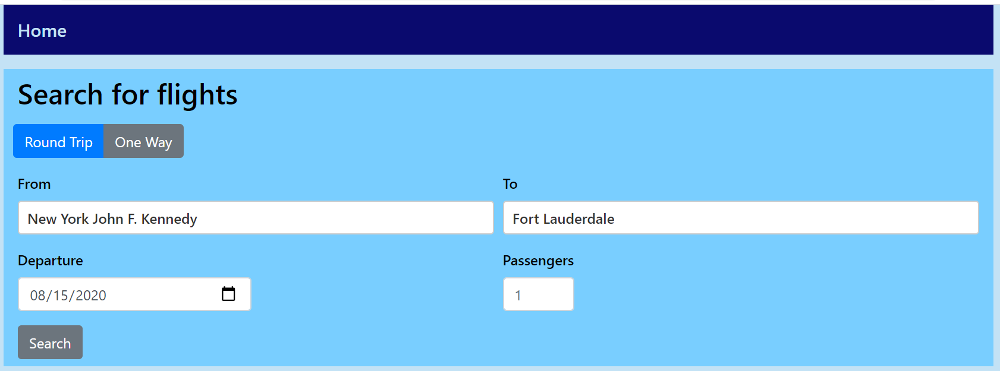
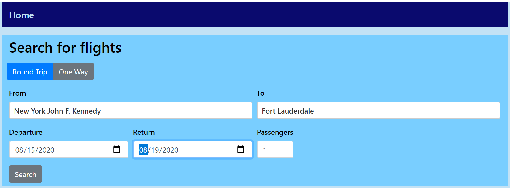
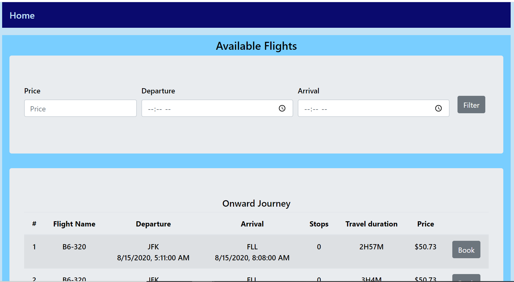
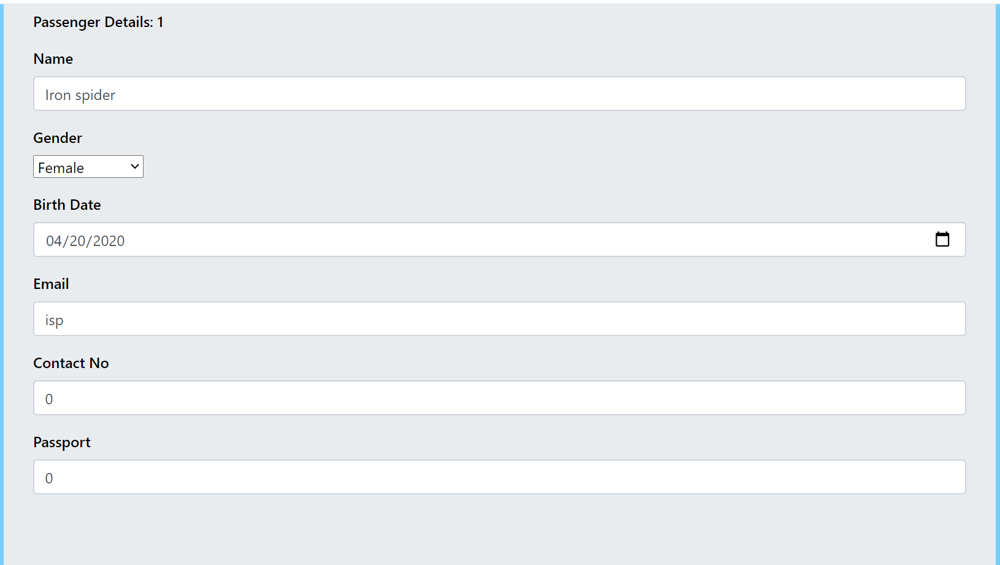
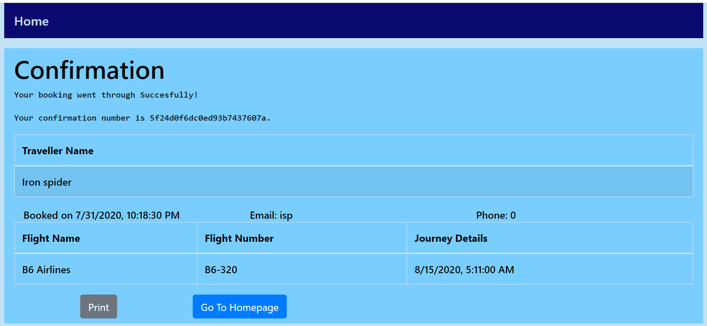

# GroupProject-Avengers

## Description
We will avenge confused travellers with a flight booking web applicaiton that allows users to search for and book flights as well as find previous bookings and manage travellers.

[Api Link](https://github.ccs.neu.edu/NEU-CS5610-SU20/GroupProject-avengers-API)

__Note__: While fetching the list of airports, not all airports would work with the search, we are still working on it. For now, for testing purposes, you can test with these airports : "Boston Logan International" and "New York J.F. Kennedy"
 * For selecting the list of Airports, we used Skyscanner Open API
 * For fetching the list of flights, we used Amadeus Open API

## Team
Ram Tarun Balagam
1. Linked UI and API layers and made connections with MongoDB with Mongoose serving as the Schema.
2. Developed GET and POST API's for confirming and retrieving Bookings.
3. Connected Flights Search page with Passenger Details page and finally with Booking Confirmation page maintaining the state across all pages.

Vinay Srampickal Joseph
1. Designed the Flight Search page and the Flight Bookings page.
2. Connected the Home Page with the Flight Search page maintaining the state across the pages.

Dhaval Mohandas
1. Designing of landing page and navigation bar.
2. Integrated the external Amadeus API, for fetching airports and flights data, with the application.

Priyank Shelat
1. Designed the confirmation page.

## Iteration 1
We used [Create React App](https://github.com/facebook/create-react-app) to start the app.\
Our homepage was inspired by [Galatia Flight Search](https://galatia.herokuapp.com/homepage).

For this iteration, we have implemented the main functionality of our app, booking flights. You first land on the homepage where they can input what type of trip and the trip details that they are looking for.

One Way Flight Search             |  Round Trip Flight Search
:-------------------------:|:-------------------------:
 | 

When you hit search, you are taken to the available flights page where it shows you flights based on your search.

Once you select the flight you like, it will ask you to input your personal information.

Then, you get a confirmation with a unique id and a read-back of your flight and personal information.

Then, last but not least, you can view the upcoming, previous, and the cancelled bookings.

Our next iterations goals will be to add, get, and show more necessary flight and user information as well as to give the user editing capability which include but are not limited to canceling tickets and passengers as well as booking return flights.

## Iteration 2

Changes in the UI:

The navigation bar now has the google sign in button, previous bookings and list of saved passengers:

Contributions:

Ram Tarun Balagam:
1. Handled Round trip bookings on front end and back end
2. Integrated Google Sign In and Authentication into the website
3. Added more intuitive UI changes like modal window messages before certain actions and mandated Login for booking

Vinay Srampickal Joseph:
1. Handled the Bookings page to list all the bookings on the Front end.
2. Created the My Passenger page and implemented add and delete passenger operations.
3. Added the functionality to add saved passengers in the booking flow.

Priyank Shelat:
1. Created form validations for flights search to ensure sensible dates are being input into the form.

Dhaval Mohandas:
1. Created GET,DELETE and POST APIs for adding passengers to the list of passengers.
2. Created GET and DELETE APIs for the bookings page.
3. Deployed the website to Heroku.
